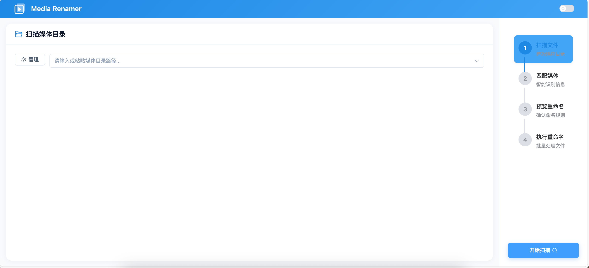
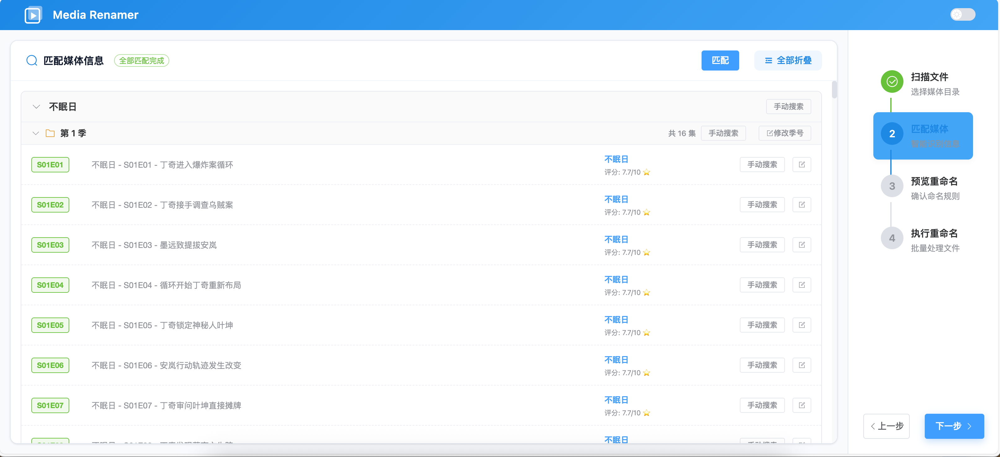
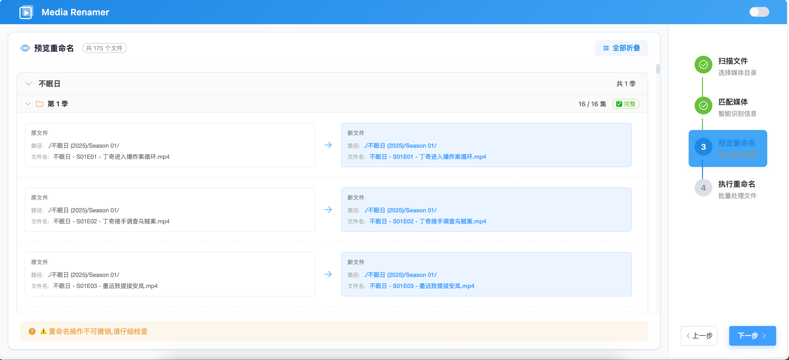
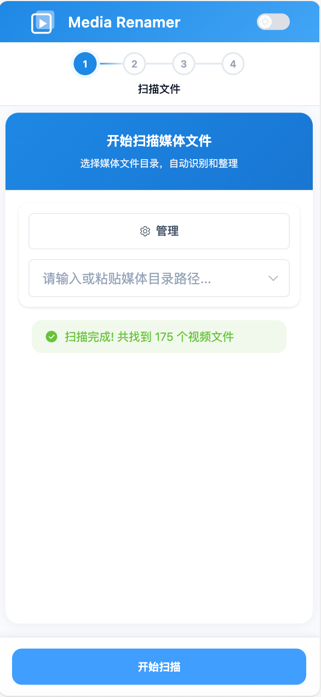
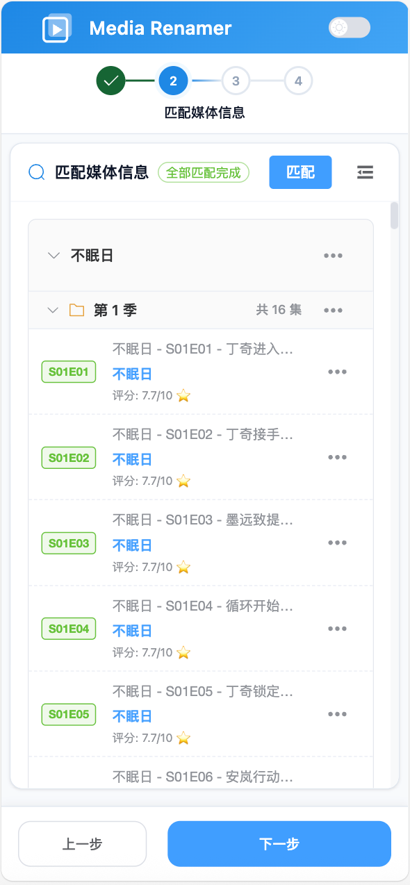
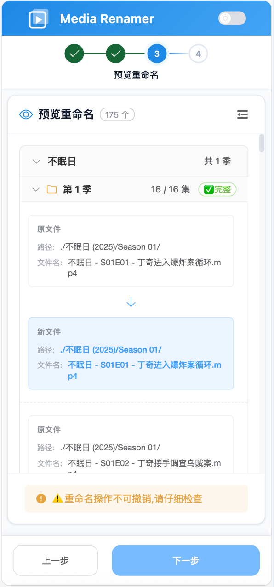
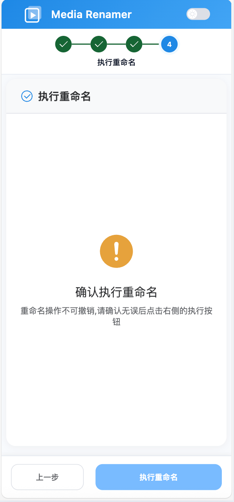

# Media Renamer

> 智能媒体文件重命名系统 - 自动解析电影和电视剧文件名并规范化整理

## 📖 项目简介

Media Renamer 是一个基于 Web 的智能媒体文件重命名工具，能够自动扫描、解析和重命名电影及电视剧视频文件。系统集成了 TMDB（The Movie Database）API，支持智能识别媒体信息，并将杂乱的文件名规范化为标准格式。适合强迫症患者，搭配 NAS 使用。

### 核心功能

- 🔍 **智能扫描** - 递归扫描指定目录，自动识别视频文件
- 🎬 **多格式解析** - 支持多种常见的电影和电视剧命名格式
- 📺 **TMDB 集成** - 自动匹配 TMDB 数据库获取准确的媒体信息
- 👀 **预览模式** - 重命名前预览变更，确保准确性
- 📁 **自动归档** - 按照媒体类型自动组织目录结构
- 🌓 **响应式设计** - 支持桌面端和移动端访问

## 界面

**pc端**








**移动端**









## 🛠️ 技术栈

### 后端
- **Java 21** + **Spring Boot 3.2.1**
- **Caffeine** - 高性能本地缓存
- **Apache Commons IO/Lang3** - 文件处理工具
- **Lombok** - 简化代码

### 前端
- **Vue 3.4** + **Vite 5.0**
- **Element Plus** - UI 组件库
- **Pinia** - 状态管理
- **Vue Router** - 路由管理
- **Axios** - HTTP 客户端

### 部署
- **Docker** + **Docker Compose**
- **Multi-stage Build** - 优化镜像体积

## 📦 快速开始

### 方式一：Docker 部署（推荐）

1. **克隆项目**
   ```bash
   git clone <repository-url>
   cd media-renamer
   ```

2. **构建镜像**
   ```bash
   docker build -t media-renamer:1.0 .
   ```

3. **配置环境变量**
   ```bash
   cp env.example .env
   # 编辑 .env 文件，至少配置 TMDB_API_KEY
   ```

4. **启动服务**
   ```bash
   docker-compose up -d
   ```

5. **访问应用**
   ```
   http://localhost:5000
   ```

### 方式二：本地开发

#### 后端启动

```bash
cd backend
# 配置 application.yml 中的 TMDB API Key
mvn spring-boot:run
```

#### 前端启动

```bash
cd frontend
npm install
npm run dev
```

## ⚙️ 配置说明

### 必需配置

| 环境变量 | 说明 | 示例            |
|---------|------|---------------|
| `TMDB_API_KEY` | TMDB API 密钥（[获取地址](https://www.themoviedb.org/settings/api)） | `d484***9225` |

### 可选配置

| 环境变量 | 说明 | 默认值 |
|---------|------|--------|
| `SPRING_PROFILES_ACTIVE` | Spring 配置文件 | `prod` |
| `TZ` | 时区 | `Asia/Shanghai` |
| `JAVA_OPTS` | JVM 参数 | `-Xmx512m` |
| `PROXY_ENABLED` | 是否启用代理 | `false` |
| `PROXY_HOST` | 代理主机 | `host.docker.internal` |
| `PROXY_PORT` | 代理端口 | `7890` |
| `PROXY_TYPE` | 代理类型 | `HTTP` |

### 支持的视频格式

- MP4, MKV, AVI, MOV, WMV, FLV, M4V, TS, RMVB

## 📂 项目结构

```
media-renamer/
├── backend/                      # Spring Boot 后端
│   ├── src/main/java/
│   │   └── com/mediarenamer/
│   │       ├── config/          # 配置类
│   │       ├── constants/       # 常量定义
│   │       ├── controller/      # REST 控制器
│   │       ├── model/           # 数据模型
│   │       ├── parser/          # 文件名解析器
│   │       ├── service/         # 业务服务
│   │       └── util/            # 工具类
│   └── src/main/resources/
│       ├── application.yml      # 主配置文件
│       └── application-prod.yml # 生产环境配置
├── frontend/                     # Vue 3 前端
│   ├── src/
│   │   ├── api/                 # API 调用
│   │   ├── components/          # 组件
│   │   ├── composables/         # 组合式函数
│   │   ├── router/              # 路由配置
│   │   ├── styles/              # 样式文件
│   │   ├── utils/               # 工具函数
│   │   └── views/               # 页面视图
│   └── vite.config.js
├── Dockerfile                    # Docker 镜像构建
├── docker-compose.yml            # Docker Compose 配置
└── README.md                     # 项目说明
```

## 🎯 使用流程

1. **扫描目录** - 选择包含视频文件的目录进行扫描
2. **匹配信息** - 系统自动解析文件名并匹配 TMDB 数据
3. **预览变更** - 查看重命名预览，可手动调整匹配结果
4. **执行重命名** - 确认后批量重命名文件并整理目录结构

## 🔧 开发说明

### 获取 TMDB API Key

1. 访问 [TMDB](https://www.themoviedb.org/)
2. 注册/登录账号
3. 进入 [Settings > API](https://www.themoviedb.org/settings/api)
4. 申请 API Key（选择 Developer 类型）

### 代理配置

如果网络环境无法直接访问 TMDB API，可配置代理：

```yaml
proxy:
  enabled: true
  host: 127.0.0.1
  port: 7897
  type: HTTP  # 或 SOCKS
```

## 📄 许可证

MIT License

## 🤝 贡献

欢迎提交 Issue 和 Pull Request！

---

**注意**：使用前请务必备份重要文件，避免数据丢失。
